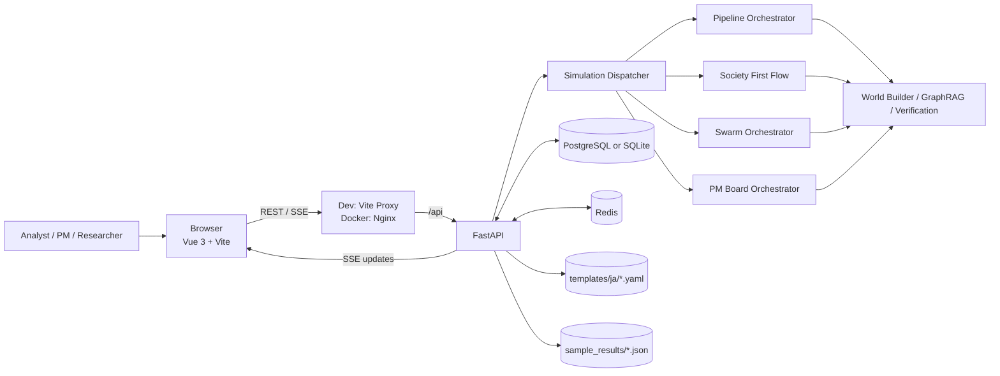
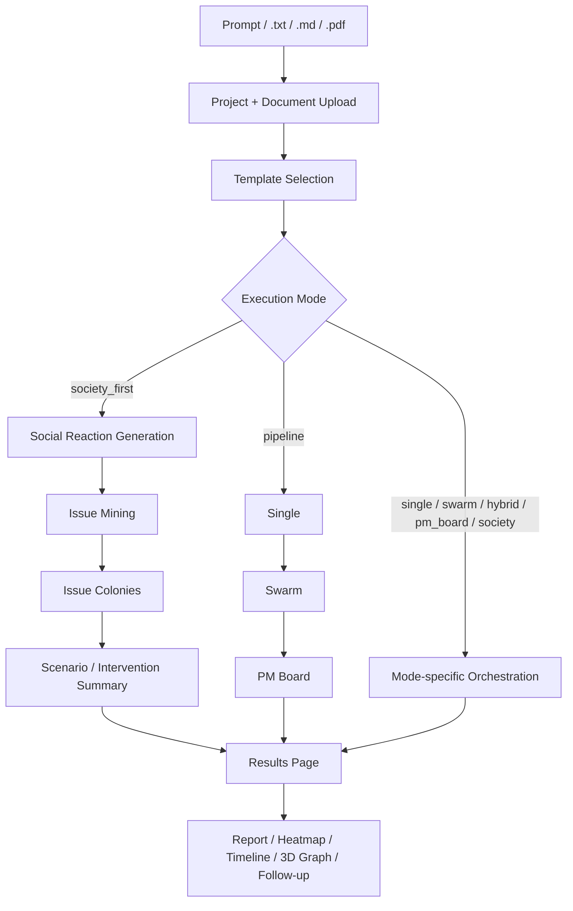

# Agent AI

[](README.md)
[](LICENSE)
[](backend/pyproject.toml)
[](frontend/package.json)
[](docker-compose.yml)

> A FastAPI + Vue 3 application that turns prompts or `.txt` / `.md` / `.pdf` documents into world models, runs hypothesis exploration through `society_first` / `pipeline` / `swarm`, and streams results through SSE plus a 3D knowledge graph.

[Quick Start](#quick-start) · [How To Use](#how-to-use) · [Use Cases](#use-cases) · [Architecture](#architecture) · [Configuration](#configuration) · [API](#api)

## What It Is

Agent AI is a full-stack application for turning prompts and research documents into a structured world model, running simulations, comparing scenarios, and synthesizing PM-style recommendations in one workflow.

- Accepts prompt-only input or uploaded `.txt` / `.md` / `.pdf` documents
- The default LaunchPad path is `society_first`, which observes broad social reactions before drilling into the most important issues
- The unified `/simulations` API supports `pipeline`, `single`, `swarm`, `hybrid`, `pm_board`, `society`, and `society_first`
- During execution it streams progress over SSE, and the results UI exposes reports, scenario comparison, PM Board output, timelines, and 3D graph history
- On startup it seeds `templates/ja/*.yaml`, so analysis templates are immediately available

## Quick Start

Docker Compose is the fastest way to run the full stack.

```bash
docker compose up --build
```

- App: `http://localhost:3000`
- FastAPI docs: `http://localhost:8000/docs`
- Sample outputs: `http://localhost:3000/sample/sample-business-001`, `http://localhost:3000/sample/sample-pmboard-001`
- In the checked-in default configuration, `config/models.yaml` uses `openai` as the provider

The stack still starts without `OPENAI_API_KEY`. In that case you can browse sample results, but live execution is disabled.

To enable live execution too:

```bash
OPENAI_API_KEY=sk-... docker compose up --build
```

Or place `OPENAI_API_KEY=...` in a repo-local `.env`. Docker Compose picks up both shell environment variables and `.env`.

## How To Use

### Start From The UI

1. Open `http://localhost:3000`
2. Choose a template such as `business_analysis`, `policy_simulation`, or `scenario_exploration`
3. Enter a prompt and optionally attach `.txt`, `.md`, or `.pdf` files
4. Start with the default `society_first` mode
5. Watch progress on `/sim/:id`, then inspect the final output on `/sim/:id/results`

LaunchPad uses `evidence_mode: strict` for live runs. Attaching documents gives the system a better chance of producing evidence-backed output.

### Use The API

This is the minimum document-backed `pipeline` flow.

1. Create a project

```bash
curl -X POST "http://localhost:8000/projects?name=EV%20Market%20Analysis"
```

2. Upload a document

```bash
curl -X POST "http://localhost:8000/projects/PROJECT_ID/documents" \
  -F "file=@sample_inputs/business_case/market_entry.md"
```

3. Create a simulation

```bash
curl -X POST http://localhost:8000/simulations \
  -H "Content-Type: application/json" \
  -d '{
    "project_id": "PROJECT_ID",
    "template_name": "business_analysis",
    "execution_profile": "standard",
    "mode": "pipeline",
    "prompt_text": "Analyze a market-entry strategy for the EV battery market",
    "evidence_mode": "strict"
  }'
```

4. Stream progress

```bash
curl -N http://localhost:8000/simulations/SIM_ID/stream
```

5. Fetch the report

```bash
curl http://localhost:8000/simulations/SIM_ID/report
```

Notes:

- For a quick prompt-only run, `mode: "society_first"` is the default product path
- If you omit `evidence_mode` in the raw API, the default is `prefer`

## Use Cases

| Case | Typical Inputs | Recommended Mode | Typical Output |
| --- | --- | --- | --- |
| Market-entry analysis | Market reports, competitor material, hypothesis notes | `society_first` -> `pipeline` | Issue prioritization, scenario comparison, PM Board actions |
| Policy or regulation impact review | Policy drafts, regulations, stakeholder memos | `policy_simulation` + `society_first` | Stakeholder reactions, issue spread, resistance points |
| Future scenario exploration | Trend reports, assumptions, future hypotheses | `scenario_exploration` + `swarm` / `hybrid` | Multiple scenarios, probability spread, agreement heatmap |
| PM-style venture review | Product memo, customer pain notes, interview summaries | `pm_board` or `pipeline` | Assumptions, winning hypothesis, GTM, 30/60/90 plan |

## Architecture

### System View



### Execution Flow



## Execution Modes

| Mode | Purpose |
| --- | --- |
| `society_first` | Default path. Generate broad social reactions first, then deepen only the highest-signal issues with Issue Colonies |
| `pipeline` | Runs `single -> swarm -> pm_board` in sequence |
| `single` | Builds a world model, advances rounds, and generates a report in one pass |
| `swarm` | Runs multiple Colonies in parallel and aggregates scenario spread plus agreement |
| `hybrid` | Multi-Colony mode exposed through the same unified API as `swarm` |
| `pm_board` | Evaluates a business or product concept with PM personas plus a Chief PM synthesis |
| `society` | Experimental mode focused on population generation and social-reaction dynamics |

LaunchPad mainly exposes `society_first`, `pipeline`, `society`, `single`, and `swarm`. `hybrid` and `pm_board` are intended for direct API usage.

## Execution Profiles

Default profile values come from `config/swarm_profiles.yaml`.

| Profile | Single Rounds | Swarm Colonies | Swarm Rounds |
| --- | --- | --- | --- |
| `preview` | 2 | 3 | 2 |
| `standard` | 4 | 5 | 4 |
| `quality` | 6 | 8 | 6 |

## Main Screens

| Route | Screen | Role |
| --- | --- | --- |
| `/` | LaunchPad | Template selection, prompt input, document upload, recent runs, sample links |
| `/sim/:id` | Live Simulation | Visualizes SSE progress, Colony state, activity logs, and graph diffs |
| `/sim/:id/results` | Results | Reports, scenario comparison, agreement heatmap, PM Board, cognitive views, follow-up flow |
| `/sample/:id` | Sample Result | Renders bundled `sample_results/*.json` through the API |
| `/populations` | Population Explorer | Inspect generated populations for society-oriented flows |

## Key Components

### Frontend

- Uses Vue Router + Pinia for state and navigation
- Uses `3d-force-graph` and `three` for the graph view
- Uses `useSimulationSSE.ts` and `useCognitiveSSE.ts` for live subscriptions
- Uses `VITE_API_BASE_URL` when set, otherwise falls back to `/api`; local development goes through the Vite proxy and Docker goes through Nginx

### Backend

- Built on FastAPI + async SQLAlchemy
- Initializes the database and seeds `templates/ja/*.yaml` on startup
- Uses `simulation_dispatcher.py` to route requests into mode-specific execution flows
- Uses `quality.py` and `verification.py` to produce evidence, trust, and verification summaries
- Parses PDFs through `document_parser.py`, and document-backed runs can enable GraphRAG

## Configuration

### Important Environment Variables

| Variable | Purpose |
| --- | --- |
| `OPENAI_API_KEY` | Required for live execution in the default configuration |
| `GOOGLE_API_KEY` | Required when using the Gemini-style provider entries in `config/llm_providers.yaml` |
| `ANTHROPIC_API_KEY` | Required when using Anthropic provider entries |
| `LLM_MODEL` | Fallback model when `config/models.yaml` does not override a task |
| `DATABASE_URL` | PostgreSQL by default; SQLite (`aiosqlite`) is also supported |
| `BACKEND_HOST` / `BACKEND_PORT` | Bind settings for manual `uvicorn` runs |
| `VITE_API_BASE_URL` | Frontend API base URL; defaults to `/api` |
| `MAX_CONCURRENT_COLONIES` | Upper bound for parallel Colony execution |
| `MAX_CONCURRENT_AGENTS` | Concurrency cap for cognitive agents |
| `MAX_ACTIVE_AGENTS` | Upper bound for total active cognitive agents |
| `COGNITIVE_MODE` | Switches between `legacy` and `advanced` |
| `REDIS_URL` | Set by Docker Compose; direct usage in the checked-in app is limited |

### Main Config Files

| File | Purpose |
| --- | --- |
| `.env.example` | Environment template |
| `config/models.yaml` | Task-level model routing and default provider |
| `config/llm_providers.yaml` | Multi-provider configuration for society-oriented flows |
| `config/cognitive.yaml` | BDI, memory, ToM, and Game Master settings |
| `config/graphrag.yaml` | GraphRAG extraction, deduplication, and community settings |
| `config/swarm_profiles.yaml` | Colony counts and round counts per profile |
| `config/perspectives.yaml` | Perspective definitions assigned to Colonies |
| `templates/ja/*.yaml` | Analysis templates |
| `templates/ja/pm_board/*.yaml` | PM Board persona templates |

## API

The recommended surface is the unified `/simulations` API.

### Core

```text
GET  /health
GET  /templates

POST /projects
GET  /projects/{project_id}
POST /projects/{project_id}/documents
GET  /projects/{project_id}/documents
```

### Simulations

```text
POST /simulations
GET  /simulations
GET  /simulations/samples
GET  /simulations/samples/{sample_id}
GET  /simulations/{sim_id}
GET  /simulations/{sim_id}/stream
GET  /simulations/{sim_id}/graph
GET  /simulations/{sim_id}/graph/history
GET  /simulations/{sim_id}/report
GET  /simulations/{sim_id}/colonies
GET  /simulations/{sim_id}/timeline
GET  /simulations/{sim_id}/backtest
POST /simulations/{sim_id}/backtest
POST /simulations/{sim_id}/followups
POST /simulations/{sim_id}/feedback
POST /simulations/{sim_id}/rerun
```

### Society / Admin

```text
GET  /society/populations
POST /society/populations/generate
GET  /society/populations/{pop_id}
POST /society/populations/{pop_id}/fork
GET  /society/simulations/{sim_id}/activation

GET  /admin/costs
GET  /admin/quality-metrics
```

Legacy `/runs` and `/swarms` routers still exist for backward compatibility, but new usage should target `/simulations`.

## Local Development

Prerequisites:

- Python 3.11+
- `uv`
- Node.js 20+
- `pnpm`
- Docker Desktop or Docker Compose

If you only want infrastructure services:

```bash
docker compose up postgres redis
```

Backend:

```bash
cd backend
uv sync --extra dev
uv run uvicorn src.app.main:app --reload --host 0.0.0.0 --port 8000
```

Frontend:

```bash
cd frontend
pnpm install
pnpm dev
```

- Frontend dev server: `http://localhost:5173`
- The Vite dev server proxies `/api` to `http://localhost:8000`

If you prefer not to run PostgreSQL locally, switch `DATABASE_URL` in `.env` to an SQLite `aiosqlite` URL. The backend creates the parent directory automatically.

## Development Checks

Backend:

```bash
cd backend
uv run pytest
```

Frontend:

```bash
cd frontend
pnpm build
pnpm test:unit
pnpm exec playwright install chromium
pnpm test:e2e
```

## Project Structure

```text
.
├── backend/              # FastAPI, SQLAlchemy, orchestration, tests
├── frontend/             # Vue 3, Vite, Pinia, 3D graph UI
├── config/               # models / providers / cognition / GraphRAG / swarm profiles
├── templates/ja/         # analysis templates and PM Board templates
├── sample_inputs/        # sample input documents
├── sample_results/       # sample outputs without an API key
├── data/                 # local data directory when using SQLite
├── docker-compose.yml
├── README.md
└── README.en.md
```

## Contributing

See [CONTRIBUTING.md](CONTRIBUTING.md) for workflow and toolchain rules.

## License

This project is distributed under [AGPL-3.0](LICENSE).
