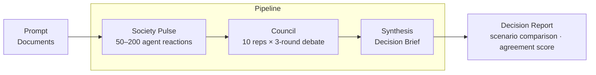
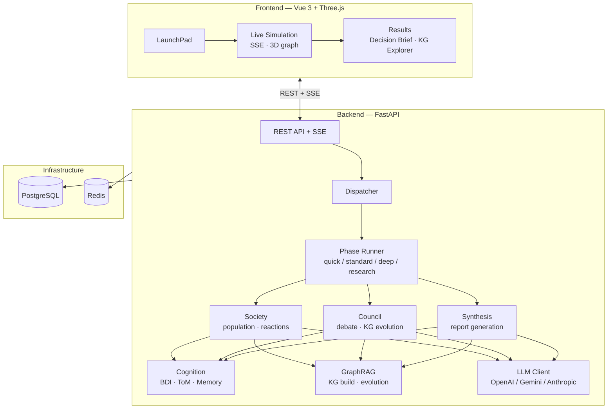

# Agent AI

[](README.md)
[](LICENSE)
[](backend/pyproject.toml)
[](frontend/package.json)
[](docker-compose.yml)

A multi-agent platform where AI agents with BDI cognitive architecture automatically run **social reaction simulation → council debate → decision report** from a research question.



## Features

- **Social reaction simulation** — 50–200 demographically-modeled agents generate initial reactions and elect representatives
- **Council deliberation** — 10 representatives including a Devil's Advocate run 3 rounds of structured debate
- **Decision Brief** — Automated report with scenario comparison, agreement scores, and recommended actions
- **GraphRAG** — Knowledge graph construction from input documents, evolving through discourse
- **BDI cognition + Theory of Mind** — Belief-Desire-Intention cycle with mental models for deep reasoning
- **3-layer memory** — Episodic, semantic, and procedural memory for long-term agent recall
- **Multi-LLM** — OpenAI / Gemini / Anthropic routing with automatic fallback
- **Real-time UI** — SSE progress streaming, 3D social graph, KG explorer, conversation transcripts

## Quick Start

```bash
cp .env.example .env        # Set OPENAI_API_KEY=...
docker compose up --build
```

- App: http://localhost:3000
- API docs: http://localhost:8000/docs

> The UI still loads without `OPENAI_API_KEY`, but live execution will be disabled.

## Architecture



## Execution Presets

| Preset | Phase Pipeline | Purpose |
| --- | --- | --- |
| **quick** | Society Pulse → Synthesis | Fast overview |
| **standard** | Society Pulse → Council → Synthesis | **Default**. Social reactions + council debate |
| **deep** | Society Pulse → Multi-Perspective → Council → PM Analysis → Synthesis | Deep dive with PM analysis |
| **research** | Society Pulse → Issue Mining → Multi-Perspective → Intervention → Synthesis | Issue extraction + intervention simulation |
| **baseline** | Single LLM analysis | Baseline comparison |

Legacy mode names (`unified`, `pipeline`, `swarm`, etc.) map to the presets above for backward compatibility.

## Screens

| Route | Screen | Content |
| --- | --- | --- |
| `/` | LaunchPad | Template selection, question wizard, prompt input, file upload |
| `/sim/:id` | Live Simulation | SSE progress, Colony status, activity feed, 3D social graph |
| `/sim/:id/results` | Results | Decision Brief, findings, scenario comparison, transcript, KG explorer |
| `/populations` | Populations | Generate, browse, and fork population data |

## API

```bash
# 1. Create simulation
curl -X POST http://localhost:8000/simulations \
  -H "Content-Type: application/json" \
  -d '{"mode":"standard","prompt_text":"Analyze EV battery market entry","evidence_mode":"strict"}'

# 2. Stream progress (SSE)
curl -N http://localhost:8000/simulations/SIM_ID/stream

# 3. Fetch report
curl http://localhost:8000/simulations/SIM_ID/report
```

<details>
<summary>All endpoints</summary>

```text
GET  /health
GET  /templates

POST /projects
GET  /projects/{project_id}
POST /projects/{project_id}/documents
GET  /projects/{project_id}/documents

POST /simulations
GET  /simulations
GET  /simulations/samples
GET  /simulations/{sim_id}
GET  /simulations/{sim_id}/stream
GET  /simulations/{sim_id}/graph
GET  /simulations/{sim_id}/graph/history
GET  /simulations/{sim_id}/report
GET  /simulations/{sim_id}/backtest
POST /simulations/{sim_id}/backtest
GET  /simulations/{sim_id}/timeline
POST /simulations/{sim_id}/followups
POST /simulations/{sim_id}/rerun

GET  /society/populations
POST /society/populations/generate
GET  /society/populations/{pop_id}
POST /society/populations/{pop_id}/fork
GET  /society/simulations/{sim_id}/activation
GET  /society/simulations/{sim_id}/meeting
GET  /society/simulations/{sim_id}/evaluation
GET  /society/simulations/{sim_id}/narrative
GET  /society/simulations/{sim_id}/demographics
GET  /society/simulations/{sim_id}/social-graph
GET  /society/simulations/{sim_id}/agents
GET  /society/simulations/{sim_id}/agents/{agent_id}
GET  /society/simulations/{sim_id}/transcript
GET  /society/simulations/{sim_id}/conversations

GET  /admin/costs
GET  /admin/quality-metrics
```

</details>

## Local Development

Prerequisites: Python 3.11+, `uv`, Node.js 20+, `pnpm`, Docker Compose

```bash
# Infrastructure only
docker compose up -d postgres redis

# Backend
cd backend && uv sync --extra dev
uv run uvicorn src.app.main:app --reload --host 0.0.0.0 --port 8000

# Frontend (separate terminal)
cd frontend && pnpm install && pnpm dev
```

Frontend dev server runs at http://localhost:5173, proxying `/api` to port 8000. Set `.env` `DATABASE_URL` to SQLite if you don't need local PostgreSQL.

## Tests

```bash
cd backend && uv run pytest                    # Backend
cd frontend && pnpm build && pnpm test:unit    # Frontend (unit)
pnpm exec playwright install chromium && pnpm test:e2e  # E2E
```

## Configuration

### Environment Variables

| Variable | Purpose |
| --- | --- |
| `OPENAI_API_KEY` | Enable live execution (default provider) |
| `GOOGLE_API_KEY` | For Gemini provider |
| `ANTHROPIC_API_KEY` | For Anthropic provider |
| `DATABASE_URL` | DB connection (default: PostgreSQL, switchable to SQLite) |
| `REDIS_URL` | LLM cache & session management |
| `COGNITIVE_MODE` | `legacy` / `advanced` |

### Config Files

| File | Purpose |
| --- | --- |
| `config/models.yaml` | Task-level model routing (3 tiers) |
| `config/llm_providers.yaml` | Multi-provider + fallback order |
| `config/cognitive.yaml` | BDI, memory, Theory of Mind, Game Master |
| `config/graphrag.yaml` | KG extraction & community detection |
| `config/perspectives.yaml` | 12 analytical perspectives (incl. adversarial) |
| `config/population_mix.yaml` | Demographics distribution & per-layer LLM weights |
| `config/swarm_profiles.yaml` | Colony counts & round counts |

### Templates

| Directory | Contents |
| --- | --- |
| `templates/ja/` | 5 analysis templates |
| `templates/ja/pm_board/` | 4 PM Board personas |
| `templates/ja/experts/` | 6 expert templates |

## Project Structure

```text
.
├── backend/src/app/
│   ├── api/routes/          # FastAPI routers
│   ├── models/              # SQLAlchemy models (34)
│   ├── services/
│   │   ├── phases/          # Execution phases (7)
│   │   ├── society/         # Social simulation (23)
│   │   ├── graphrag/        # KG extraction pipeline (8)
│   │   ├── cognition/       # BDI + ToM (8)
│   │   ├── memory/          # 3-layer memory (6)
│   │   ├── communication/   # Debate protocol (4)
│   │   └── game_master/     # Environment management (4)
│   ├── llm/                 # Multi-LLM client
│   └── sse/                 # SSE manager
├── frontend/src/
│   ├── pages/               # 6 pages
│   ├── components/          # 28 components
│   ├── composables/         # 7 composables (3D graph, etc.)
│   └── stores/              # 8 Pinia stores
├── config/                  # YAML configs
├── templates/ja/            # Templates
├── experiments/             # Experiment scripts
└── docker-compose.yml       # PostgreSQL, Redis, Backend, Frontend
```

## Contributing

See [CONTRIBUTING.md](CONTRIBUTING.md).

## License

[AGPL-3.0](LICENSE)
