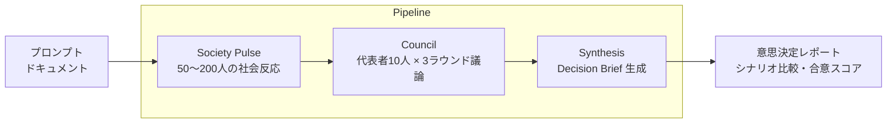
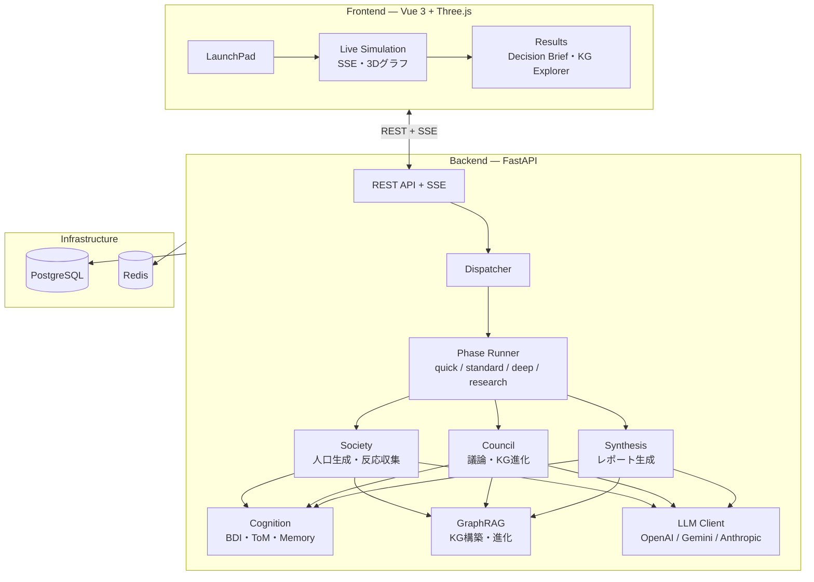

# Agent AI

[](README.en.md)
[](LICENSE)
[](backend/pyproject.toml)
[](frontend/package.json)
[](docker-compose.yml)

調査テーマを入力すると、BDI 認知アーキテクチャを持つ AI エージェント群が **社会反応シミュレーション → 評議会議論 → 意思決定レポート** を自動生成するマルチエージェントプラットフォームです。



## 特徴

- **社会反応シミュレーション** — 人口統計ベースで生成した 50〜200 人のエージェントが初期反応を生成し、代表者を選出
- **評議会議論** — Devil's Advocate を含む 10 人の代表者が 3 ラウンドの構造化議論を実施
- **Decision Brief** — シナリオ比較・合意スコア・推奨アクションを含むレポートを自動生成
- **GraphRAG** — 入力ドキュメントからナレッジグラフを構築し、議論を通じて進化
- **BDI 認知 + Theory of Mind** — Belief-Desire-Intention サイクルと心の理論による深い推論
- **3 層メモリ** — エピソード・意味・手続き記憶によるエージェントの長期記憶
- **マルチ LLM** — OpenAI / Gemini / Anthropic のフォールバック付きルーティング
- **リアルタイム UI** — SSE 進捗配信、3D 社会グラフ、KG Explorer、会話トランスクリプト

## クイックスタート

```bash
cp .env.example .env        # OPENAI_API_KEY=... を設定
docker compose up --build
```

- アプリ: http://localhost:3000
- API ドキュメント: http://localhost:8000/docs

> `OPENAI_API_KEY` が未設定でも UI は起動しますが、ライブ実行は無効になります。

## アーキテクチャ



## 実行プリセット

| プリセット | フェーズ構成 | 用途 |
| --- | --- | --- |
| **quick** | Society Pulse → Synthesis | 高速な概要分析 |
| **standard** | Society Pulse → Council → Synthesis | **既定**。社会反応＋評議会議論 |
| **deep** | Society Pulse → Multi-Perspective → Council → PM Analysis → Synthesis | PM 分析を含む深掘り |
| **research** | Society Pulse → Issue Mining → Multi-Perspective → Intervention → Synthesis | 論点抽出＋介入シミュレーション |
| **baseline** | 単一 LLM 分析 | ベースライン比較用 |

旧モード名（`unified`, `pipeline`, `swarm` 等）は後方互換のため上記にマッピングされます。

## 画面

| Route | 画面 | 内容 |
| --- | --- | --- |
| `/` | LaunchPad | テンプレート選択、質問ウィザード、プロンプト入力、ファイルアップロード |
| `/sim/:id` | Live Simulation | SSE 進捗、Colony 状態、Activity Feed、3D 社会グラフ |
| `/sim/:id/results` | Results | Decision Brief、Findings、シナリオ比較、トランスクリプト、KG Explorer |
| `/sample/:id` | Sample Result | サンプル結果の閲覧 |
| `/populations` | Populations | 人口データの生成・閲覧・fork |

## API

```bash
# 1. シミュレーション作成
curl -X POST http://localhost:8000/simulations \
  -H "Content-Type: application/json" \
  -d '{"mode":"standard","prompt_text":"EVバッテリー市場に参入すべきか","evidence_mode":"strict"}'

# 2. 進捗監視 (SSE)
curl -N http://localhost:8000/simulations/SIM_ID/stream

# 3. レポート取得
curl http://localhost:8000/simulations/SIM_ID/report
```

<details>
<summary>全エンドポイント一覧</summary>

```text
GET  /health
GET  /templates

POST /projects
GET  /projects/{project_id}
POST /projects/{project_id}/documents
GET  /projects/{project_id}/documents

POST /runs
GET  /runs
GET  /runs/{run_id}
GET  /runs/{run_id}/stream
GET  /runs/{run_id}/report
GET  /runs/{run_id}/timeline
GET  /runs/{run_id}/events
GET  /runs/{run_id}/graph
POST /runs/{run_id}/followups
POST /runs/{run_id}/rerun

POST /simulations
GET  /simulations
GET  /simulations/samples
GET  /simulations/samples/{sample_id}
GET  /simulations/{sim_id}
GET  /simulations/{sim_id}/stream
GET  /simulations/{sim_id}/graph
GET  /simulations/{sim_id}/graph/history
GET  /simulations/{sim_id}/report
GET  /simulations/{sim_id}/backtest
POST /simulations/{sim_id}/backtest
GET  /simulations/{sim_id}/timeline
POST /simulations/{sim_id}/followups
POST /simulations/{sim_id}/rerun

GET  /society/populations
POST /society/populations/generate
GET  /society/populations/{pop_id}
POST /society/populations/{pop_id}/fork
GET  /society/simulations/{sim_id}/activation
GET  /society/simulations/{sim_id}/meeting
GET  /society/simulations/{sim_id}/evaluation
GET  /society/simulations/{sim_id}/narrative
GET  /society/simulations/{sim_id}/demographics
GET  /society/simulations/{sim_id}/social-graph
GET  /society/simulations/{sim_id}/agents
GET  /society/simulations/{sim_id}/agents/{agent_id}
GET  /society/simulations/{sim_id}/transcript
GET  /society/simulations/{sim_id}/conversations

GET  /admin/costs
GET  /admin/quality-metrics
```

</details>

## ローカル開発

前提: Python 3.11+、`uv`、Node.js 20+、`pnpm`、Docker Compose

```bash
# 依存サービスのみ起動
docker compose up -d postgres redis

# バックエンド
cd backend && uv sync --extra dev
uv run uvicorn src.app.main:app --reload --host 0.0.0.0 --port 8000

# フロントエンド (別ターミナル)
cd frontend && pnpm install && pnpm dev
```

フロントエンド開発サーバーは http://localhost:5173 で起動し、`/api` を 8000 番にプロキシします。PostgreSQL が不要な場合は `.env` の `DATABASE_URL` を SQLite に変更できます。

## テスト

```bash
cd backend && uv run pytest                    # バックエンド
cd frontend && pnpm build && pnpm test:unit    # フロントエンド (unit)
pnpm exec playwright install chromium && pnpm test:e2e  # E2E
```

## 設定

### 環境変数

| 変数 | 用途 |
| --- | --- |
| `OPENAI_API_KEY` | ライブ実行を有効化（既定 provider） |
| `GOOGLE_API_KEY` | Gemini provider 使用時 |
| `ANTHROPIC_API_KEY` | Anthropic provider 使用時 |
| `DATABASE_URL` | DB 接続先（既定: PostgreSQL、SQLite に変更可） |
| `REDIS_URL` | LLM キャッシュ・セッション管理 |
| `LLM_MODEL` | 既定モデル（既定: `gpt-4o`） |
| `COGNITIVE_MODE` | `legacy` / `advanced` |
| `MAX_ACTIVE_AGENTS` | 最大エージェント数（既定: `100`） |
| `MAX_CONCURRENT_AGENTS` | 同時実行エージェント数（既定: `30`） |
| `MAX_CONCURRENT_COLONIES` | 同時実行 Colony 数（既定: `5`） |
| `LLM_CACHE_TTL` | LLM キャッシュ TTL 秒（既定: `3600`） |

### 設定ファイル

| ファイル | 内容 |
| --- | --- |
| `config/models.yaml` | タスク別モデルルーティング（3 階層） |
| `config/llm_providers.yaml` | マルチ provider + フォールバック順序 |
| `config/cognitive.yaml` | BDI、メモリ、Theory of Mind、Game Master |
| `config/graphrag.yaml` | ナレッジグラフ抽出・コミュニティ検出 |
| `config/perspectives.yaml` | 12 種の分析視点（adversarial 含む） |
| `config/population_mix.yaml` | 人口統計分布・レイヤー別 LLM 割当 |
| `config/swarm_profiles.yaml` | Colony 数・ラウンド数 |

### テンプレート

| ディレクトリ | 内容 |
| --- | --- |
| `templates/ja/` | 分析テンプレート 5 種 |
| `templates/ja/pm_board/` | PM Board ペルソナ 4 種 |
| `templates/ja/experts/` | 専門家テンプレート 6 種 |

## プロジェクト構成

```text
.
├── backend/src/app/
│   ├── api/routes/          # FastAPI ルーター (7)
│   ├── models/              # SQLAlchemy モデル (34)
│   ├── services/
│   │   ├── phases/          # 実行フェーズ (7)
│   │   ├── society/         # 社会シミュレーション (21)
│   │   ├── graphrag/        # KG 抽出パイプライン (8)
│   │   ├── cognition/       # BDI + ToM (8)
│   │   ├── memory/          # 3 層メモリ (6)
│   │   ├── communication/   # 議論プロトコル (4)
│   │   ├── game_master/     # 環境管理 (4)
│   │   ├── scheduling/      # エージェントスケジューリング (1)
│   │   └── *.py             # オーケストレーター・ユーティリティ (28)
│   ├── llm/                 # マルチ LLM クライアント + アダプタ
│   └── sse/                 # SSE マネージャ
├── frontend/src/
│   ├── pages/               # 6 ページ
│   ├── components/          # 19 コンポーネント
│   ├── composables/         # 7 コンポジション (3D グラフ等)
│   └── stores/              # 8 Pinia ストア
├── config/                  # YAML 設定群
├── templates/ja/            # テンプレート群
├── experiments/             # 実験スクリプト
└── docker-compose.yml       # PostgreSQL, Redis, Backend, Frontend
```

## Contributing

[CONTRIBUTING.md](CONTRIBUTING.md) を参照してください。

## License

[AGPL-3.0](LICENSE)
