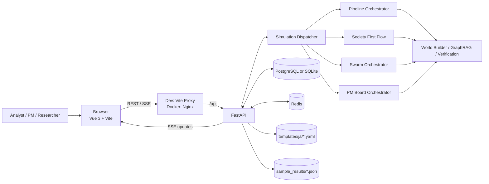
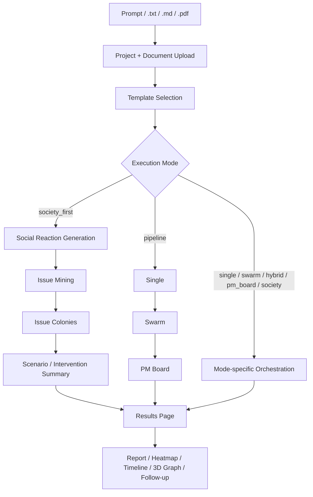

# Agent AI

[](README.en.md)
[](LICENSE)
[](backend/pyproject.toml)
[](frontend/package.json)
[](docker-compose.yml)

> プロンプトや `.txt` / `.md` / `.pdf` 文書から世界モデルを構築し、`society_first` / `pipeline` / `swarm` で仮説検証を進め、SSE と 3D ナレッジグラフで結果を追える FastAPI + Vue 3 アプリです。

[クイックスタート](#クイックスタート) · [使い方](#使い方) · [活用事例](#活用事例) · [アーキテクチャ](#アーキテクチャ) · [設定](#設定) · [API](#api)

## これは何か

Agent AI は、分析プロンプトや調査文書を起点に、世界モデルの構築、シミュレーション実行、シナリオ比較、PM 観点での統合評価までを一気通貫で扱うフルスタックアプリです。

- 入力はプロンプト単体、または `.txt` / `.md` / `.pdf` 文書アップロードに対応
- LaunchPad の既定導線は `society_first` で、社会反応を先に広く観測してから重要論点を深掘り
- 統一 `/simulations` API から `pipeline` / `single` / `swarm` / `hybrid` / `pm_board` / `society` / `society_first` を実行可能
- 実行中は SSE で進捗を配信し、結果画面ではレポート、シナリオ比較、PM Board、タイムライン、3D グラフ履歴を確認可能
- 起動時に `templates/ja/*.yaml` を自動シードし、分析テンプレートを即時利用可能

## クイックスタート

最短で試すなら Docker Compose が一番簡単です。

```bash
docker compose up --build
```

- アプリ: `http://localhost:3000`
- FastAPI Docs: `http://localhost:8000/docs`
- サンプル結果: `http://localhost:3000/sample/sample-business-001`, `http://localhost:3000/sample/sample-pmboard-001`
- デフォルトのチェックイン済み設定では `config/models.yaml` の provider は `openai`

`OPENAI_API_KEY` が未設定でも起動はできます。その場合はサンプル閲覧のみ有効で、ライブ実行は無効です。

ライブ実行も有効にする場合:

```bash
OPENAI_API_KEY=sk-... docker compose up --build
```

またはリポジトリ直下の `.env` に `OPENAI_API_KEY=...` を置いてください。Docker Compose はシェル環境変数と `.env` を自動で読み込みます。

## 使い方

### UI から始める

1. `http://localhost:3000` を開く
2. `ビジネス分析` / `政策シミュレーション` / `シナリオ探索` のテンプレートを選ぶ
3. 指示文を入力し、必要なら `.txt` / `.md` / `.pdf` を添付する
4. まずは既定の `society_first` のまま実行する
5. 実行中は `/sim/:id` で SSE ベースの進捗を見て、完了後に `/sim/:id/results` で結果を確認する

LaunchPad からのライブ実行は `evidence_mode: strict` を使います。文書を添付したほうが、引用可能な根拠付きの出力になりやすくなります。

### API から使う

文書を添付して `pipeline` を回す最小例です。

1. プロジェクトを作る

```bash
curl -X POST "http://localhost:8000/projects?name=EV%E5%B8%82%E5%A0%B4%E5%88%86%E6%9E%90"
```

2. 文書をアップロードする

```bash
curl -X POST "http://localhost:8000/projects/PROJECT_ID/documents" \
  -F "file=@sample_inputs/business_case/market_entry.md"
```

3. シミュレーションを作成する

```bash
curl -X POST http://localhost:8000/simulations \
  -H "Content-Type: application/json" \
  -d '{
    "project_id": "PROJECT_ID",
    "template_name": "business_analysis",
    "execution_profile": "standard",
    "mode": "pipeline",
    "prompt_text": "EVバッテリー市場への新規参入戦略を分析する",
    "evidence_mode": "strict"
  }'
```

4. 進捗をストリームで監視する

```bash
curl -N http://localhost:8000/simulations/SIM_ID/stream
```

5. レポートを取得する

```bash
curl http://localhost:8000/simulations/SIM_ID/report
```

補足:

- 文書なしで素早く試すなら `mode: "society_first"` が既定導線です
- 生の API で `evidence_mode` を省略すると既定値は `prefer` です

## 活用事例

| ケース | 入力例 | おすすめモード | 得られるもの |
| --- | --- | --- | --- |
| 新規市場参入の検討 | 市場レポート、競合資料、仮説メモ | `society_first` → `pipeline` | 重要論点、シナリオ比較、PM Board の打ち手 |
| 制度・規制の影響評価 | 政策案、法令、関係者メモ | `policy_simulation` + `society_first` | ステークホルダー反応、論点の拡散、反発ポイント |
| 将来シナリオの探索 | 技術トレンド、前提条件、将来仮説 | `scenario_exploration` + `swarm` / `hybrid` | 複数シナリオ、確率分布、合意度ヒートマップ |
| 事業アイデアの PM レビュー | 事業案、顧客課題メモ、インタビュー要約 | `pm_board` または `pipeline` | 前提整理、勝ち筋、GTM 仮説、30/60/90 日計画 |

## アーキテクチャ

### システム全体



### 実行フロー



## 実行モード

| Mode | 用途 |
| --- | --- |
| `society_first` | 既定導線。社会反応を広く生成し、重要論点だけを Issue Colony で深掘り |
| `pipeline` | `single -> swarm -> pm_board` を順番に実行 |
| `single` | 単一ランで世界モデル構築、ラウンド進行、レポート生成まで実行 |
| `swarm` | 複数 Colony を並列実行し、シナリオ分布と合意度を集約 |
| `hybrid` | `swarm` と同じ統一 API で呼べる多 Colony 系モード |
| `pm_board` | PM ペルソナ群と Chief PM で事業・施策を評価 |
| `society` | experimental。人口生成と社会反応のダイナミクスを重視したモード |

LaunchPad の詳細設定で選べるのは主に `society_first` / `pipeline` / `society` / `single` / `swarm` です。`hybrid` と `pm_board` は API から直接使う想定です。

## 実行プロファイル

`config/swarm_profiles.yaml` に基づく既定プロファイルです。

| Profile | Single ラウンド数 | Swarm Colony 数 | Swarm ラウンド数 |
| --- | --- | --- | --- |
| `preview` | 2 | 3 | 2 |
| `standard` | 4 | 5 | 4 |
| `quality` | 6 | 8 | 6 |

## 主要画面

| Route | 画面 | 役割 |
| --- | --- | --- |
| `/` | LaunchPad | テンプレート選択、プロンプト入力、文書アップロード、最近の実行履歴、サンプル導線 |
| `/sim/:id` | Live Simulation | SSE で進捗、Colony 状態、アクティビティログ、グラフ差分を可視化 |
| `/sim/:id/results` | Results | レポート、シナリオ比較、合意ヒートマップ、PM Board、認知ビュー、フォローアップ |
| `/sample/:id` | Sample Result | `sample_results/*.json` を API 経由で表示 |
| `/populations` | Population Explorer | Society 系で生成した人口データの確認 |

## 主要コンポーネント

### フロントエンド

- Vue Router + Pinia で状態と画面遷移を管理
- `3d-force-graph` と `three` でナレッジグラフを可視化
- `useSimulationSSE.ts` / `useCognitiveSSE.ts` でライブ更新を購読
- `VITE_API_BASE_URL` 未設定時は `/api` を使用し、ローカルでは Vite proxy、Docker では Nginx 経由でバックエンドへ接続

### バックエンド

- FastAPI + async SQLAlchemy 構成
- 起動時に DB 初期化と `templates/ja/*.yaml` のシードを実行
- `simulation_dispatcher.py` が mode ごとの実行フローへ振り分け
- `quality.py` と `verification.py` が evidence / trust / verification 状態を整形
- PDF は `document_parser.py` で抽出し、文書入力時は GraphRAG を有効化可能

## 設定

### 主要な環境変数

| 変数 | 用途 |
| --- | --- |
| `OPENAI_API_KEY` | デフォルト構成でライブ実行に必要 |
| `GOOGLE_API_KEY` | `config/llm_providers.yaml` の Gemini 系設定を使う場合に必要 |
| `ANTHROPIC_API_KEY` | Anthropic 系設定を使う場合に必要 |
| `LLM_MODEL` | `config/models.yaml` に明示設定がない時のフォールバック |
| `DATABASE_URL` | 既定は PostgreSQL。SQLite (`aiosqlite`) も利用可能 |
| `BACKEND_HOST` / `BACKEND_PORT` | 手動で `uvicorn` を起動する時の待受設定 |
| `VITE_API_BASE_URL` | フロントエンドの API ベース URL。未指定時は `/api` |
| `MAX_CONCURRENT_COLONIES` | Swarm 実行時の Colony 並列数上限 |
| `MAX_CONCURRENT_AGENTS` | 認知系エージェントの同時実行上限 |
| `MAX_ACTIVE_AGENTS` | 認知エージェント総数の上限設定 |
| `COGNITIVE_MODE` | `legacy` / `advanced` の切り替え |
| `REDIS_URL` | Docker Compose では設定されるが、現行コードでの直接参照は限定的 |

### 主要な設定ファイル

| ファイル | 内容 |
| --- | --- |
| `.env.example` | 環境変数テンプレート |
| `config/models.yaml` | タスク別のモデルルーティングとデフォルト provider |
| `config/llm_providers.yaml` | Society 系のマルチ LLM provider 設定 |
| `config/cognitive.yaml` | BDI、Memory、ToM、Game Master の設定 |
| `config/graphrag.yaml` | GraphRAG の抽出、重複解決、コミュニティ設定 |
| `config/swarm_profiles.yaml` | プロファイルごとの Colony 数とラウンド数 |
| `config/perspectives.yaml` | Colony に割り当てる視点定義 |
| `templates/ja/*.yaml` | 分析テンプレート |
| `templates/ja/pm_board/*.yaml` | PM Board 用ペルソナテンプレート |

## API

通常は統一 `/simulations` API を使う想定です。

### 基本

```text
GET  /health
GET  /templates

POST /projects
GET  /projects/{project_id}
POST /projects/{project_id}/documents
GET  /projects/{project_id}/documents
```

### Simulations

```text
POST /simulations
GET  /simulations
GET  /simulations/samples
GET  /simulations/samples/{sample_id}
GET  /simulations/{sim_id}
GET  /simulations/{sim_id}/stream
GET  /simulations/{sim_id}/graph
GET  /simulations/{sim_id}/graph/history
GET  /simulations/{sim_id}/report
GET  /simulations/{sim_id}/colonies
GET  /simulations/{sim_id}/timeline
GET  /simulations/{sim_id}/backtest
POST /simulations/{sim_id}/backtest
POST /simulations/{sim_id}/followups
POST /simulations/{sim_id}/feedback
POST /simulations/{sim_id}/rerun
```

### Society / Admin

```text
GET  /society/populations
POST /society/populations/generate
GET  /society/populations/{pop_id}
POST /society/populations/{pop_id}/fork
GET  /society/simulations/{sim_id}/activation

GET  /admin/costs
GET  /admin/quality-metrics
```

後方互換用に `/runs` と `/swarms` ルーターも残っていますが、新規利用は `/simulations` を推奨します。

## ローカル開発

前提:

- Python 3.11+
- `uv`
- Node.js 20+
- `pnpm`
- Docker Desktop または Docker Compose

依存サービスだけ起動する場合:

```bash
docker compose up postgres redis
```

バックエンド:

```bash
cd backend
uv sync --extra dev
uv run uvicorn src.app.main:app --reload --host 0.0.0.0 --port 8000
```

フロントエンド:

```bash
cd frontend
pnpm install
pnpm dev
```

- フロントエンド開発サーバー: `http://localhost:5173`
- Vite 開発サーバーは `/api` を `http://localhost:8000` にプロキシ

PostgreSQL を使わずに開発したい場合は、`.env` の `DATABASE_URL` を SQLite の `aiosqlite` URL に変更してください。バックエンド側で親ディレクトリを自動作成します。

## 開発時の確認

バックエンド:

```bash
cd backend
uv run pytest
```

フロントエンド:

```bash
cd frontend
pnpm build
pnpm test:unit
pnpm exec playwright install chromium
pnpm test:e2e
```

## プロジェクト構成

```text
.
├── backend/              # FastAPI, SQLAlchemy, orchestration, tests
├── frontend/             # Vue 3, Vite, Pinia, 3D graph UI
├── config/               # models / providers / cognition / GraphRAG / swarm profiles
├── templates/ja/         # 分析テンプレートと PM Board テンプレート
├── sample_inputs/        # 入力用サンプル文書
├── sample_results/       # API キー不要の結果サンプル
├── data/                 # SQLite 利用時のローカルデータ置き場
├── docker-compose.yml
├── README.md
└── README.en.md
```

## Contributing

開発フローとツール方針は [CONTRIBUTING.md](CONTRIBUTING.md) を参照してください。

## License

このプロジェクトは [AGPL-3.0](LICENSE) の下で提供されています。
