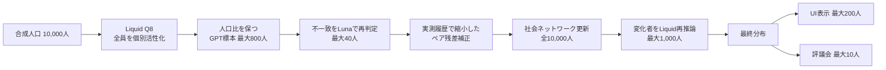

# Liquid + GPT 1万人ハイブリッド推論（参考・現在は無効）

> 現在の既定実行はOpenAI API専用です。この文書は過去のローカル推論構成を再利用する場合の参考として残しています。

## 目的と「1万人フル稼働」の意味

標準の Society Pulse では、合成人口10,000人全員が Liquid のローカルLLMで個別に初期反応を生成する。その後、全員が社会ネットワーク上の数値更新に参加し、立場が変わった住民のうち最大1,000人を Liquid で再推論する。

10,000人同士の全組合せ会話は行わない。これは約1億の有向ペアを扱うため、M4 MacBook Air 32 GBと約1ドルの条件に合わない。評議会で自然言語の複数ラウンド会話を行うのは、市民代表と専門家を合わせた最大10人である。

## 人口マスターの再利用

国勢調査ベースの住民プロフィールは、シミュレーションごとに作り直さない。人口数、人口構成設定、生成器バージョンからデフォルト人口キーを作り、次の順序で取得する。

1. シミュレーションに `population_id` が明示されていれば、その人口を使う。
2. 同じデフォルト人口キーを持つ準備済み人口があれば、住民と社会ネットワークを再利用する。
3. 旧バージョンが作った `{"count": 10000}` 形式の完全な人口があれば、それをデフォルトとして引き継ぐ。
4. どれもなければ一度だけ作成する。同時実行が競合した場合は、先に保存された人口へ合流する。

人口構成設定または生成器バージョンを変えた場合だけ、新しいデフォルト人口を作る。ここで再利用するのは年齢、地域、職業、性格、記憶、社会関係などの人口マスターである。テーマ固有の `stance` と `confidence` は活性化結果なので、新しいテーマでは改めて推論する。



## 実行構成

| 役割 | Provider / model | 上限 | 用途 |
| --- | --- | ---: | --- |
| 人口活性化 | Ollama / `LFM2.5-1.2B-JP-202606` Q8_0 | 10,000 | 全住民の `stance` と `confidence` |
| GPT shadow | `gpt-5.4-nano` | 800 | 人口比を保つ層化標本でLiquidとの差を測定 |
| 不一致再判定 | `gpt-5.6-luna` | 40 | 立場不一致・信頼度差が大きい事例を再判定 |
| 社会再反応 | Ollama / Liquid | 1,000 | 数値伝播後に立場が変化した住民だけ再推論 |
| ナラティブ | Ollama / Liquid | 100 | 代表的な自然言語説明を補完 |

GPT出力は正解データとして扱わない。LiquidとGPTの同一人物ペアの差を補正候補とし、同じテーマ分類に3件以上の実測結果がある場合だけ、Jensen-Shannon距離が最小になる補正率を履歴から選ぶ。履歴が足りない場合は補正を50%に縮小する。

## セットアップ

既存の `OPENAI_API_KEY` をそのまま使用する。LiquidはOllama経由なので追加のAPIキーは不要。

```bash
ollama pull hf.co/LiquidAI/LFM2.5-1.2B-JP-202606-GGUF:Q8_0
ollama list

cd backend
uv sync
uv run python scripts/benchmark_liquid_activation.py --count 100 --concurrency 1
```

設定ファイルは次の2つ。

- `config/hybrid_inference.yaml`: 人数、標本数、並列度、チャンク、予算
- `config/llm_providers.yaml`: モデル、API endpoint、価格、fallback方針

Liquid、GPT shadow、GPT escalation は `allow_fallback: false` である。Liquid停止時に10,000件が有料APIへ流れることはない。実行前にOllamaの `/api/tags` を確認し、指定モデルがなければ最初の人口チャンクより前に停止する。

課金対象のGPT照合・再判定は自動再試行を行わない。失敗した回答は補正ペアから除外し、次回の同一シミュレーション再開時に未完了分として再実行できる。Liquidはローカル処理なので一時失敗を2回まで再試行する。

## 費用包絡

設定上のハイブリッド枠は `$0.85`、評議会・レポート等の予約枠は `$0.15`、合計は約 `$1.00`。

構造化出力で実際に送る completion 上限を使った保守計算は次の通り。

| 内訳 | 計算 | 上限 |
| --- | --- | ---: |
| Nano shadow | 800 × (1,600 input × $0.20/M + 384 output × $1.25/M) | $0.64000 |
| Luna escalation | 40 × (1,800 input × $1.00/M + 512 output × $6.00/M) | $0.19488 |
| 下流フェーズ予約 | 固定予約 | $0.15000 |
| 合計 |  | **$0.98488** |

既存キーで行った1件ずつの疎通実測は、Nanoが379 input / 140 output、Lunaが380 input / 110 outputだった。この1件実測を800件・40件へ単純外挿した活性化API費用は約 `$0.24` だが、テーマ長、再試行、評議会、レポートにより実額は変わる。最終的な請求額を保証する値ではない。

Batch APIは割引がある一方で非同期完了を前提とするため、SSEで進捗を返す通常実行には使っていない。オフライン評価専用経路を作る場合の候補とする。

## M4 MacBook Air 32 GBでの実測

Q8_0、並列度1、最終の最小JSONプロンプト（外部KG・groundingなし）で、ローカル人口活性化だけを測定した。外部参考情報が入る実行はこの値より遅くなり得る。

| 件数 | 有効回答 | 経過 | 1万人への単純外挿 |
| ---: | ---: | ---: | ---: |
| 100 | 100 / 100 | 54.294秒 | 90.5分 |
| 200 | 200 / 200 | 125.372秒 | 104.5分 |

したがって初期10,000人活性化の目安は、少なくとも約90〜105分。これは初期活性化だけの外挿であり、800件のGPT照合、全人口の数値伝播、最大1,000件のLiquid再推論、100件のナラティブ、評議会、レポート時間を含まない。MacBook Airはファンレスなので、長時間の温度状態によってさらに遅くなる可能性がある。

費用と時間を伴う10,000人の完全実行は検証時に自動では走らせない。単体・統合試験では同じチャンク、保存、再開、予算、補正経路を小さな人口で検証する。

## チェックポイントと再開

各回答は `agent_activation_results` にチャンク単位で保存する。

- `local_initial`: Liquid初期反応
- `gpt_shadow`: Nano照合
- `gpt_escalation`: Luna再判定
- `local_social`: 社会変化後のLiquid再反応
- `social_final`: 数値伝播と再推論を統合した全住民の最終状態

同じ simulation、seed、stage、provider の成功済み住民は再実行時にスキップする。`social_final` が途中までしかない場合は、住民ごとに `local_initial` を補完して部分チェックポイントによる欠落を防ぐ。

## 表示と計算の分離

計算対象とUI表示対象は別である。

- 計算・最終保存: 10,000人
- SSE / social graph表示: 最大200人
- activation会話ログ: 最大100人
- KG抽出入力: 最大100人
- 伝播の可視化イベント: 1ラウンド最大500変化

表示上限はブラウザとDBイベント量を守るためのもので、母集団計算や最終分布は切り捨てない。結果画面では「母集団」「活性化済み」「GPT照合済み」「評議会代表」を別々に表示する。

## 精度の確認方法

10,000人に増やすだけでは真の精度向上は保証されない。同じモデルの系統誤差は人数を増やしても残るため、次を継続する。

1. テーマ分類ごとに未使用の実調査結果を登録する。
2. Liquid単独、GPT残差100%、履歴学習済み縮小補正を同じholdoutで比較する。
3. 分布誤差とJensen-Shannon距離が改善した構成だけを採用する。
4. GPT照合数800、再判定40、社会再推論1,000を個別にablationする。
5. 実測が3件未満の分類では学習済みという表示をせず、保守的な既定値を使う。

参考:

- [Liquid AI model library](https://docs.liquid.ai/lfm/models/complete-library)
- [Official GGUF repository](https://huggingface.co/LiquidAI/LFM2.5-1.2B-JP-202606-GGUF/tree/main)
- [OpenAI Structured Outputs](https://developers.openai.com/api/docs/guides/structured-outputs)
- [OpenAI API pricing](https://developers.openai.com/api/docs/pricing)
