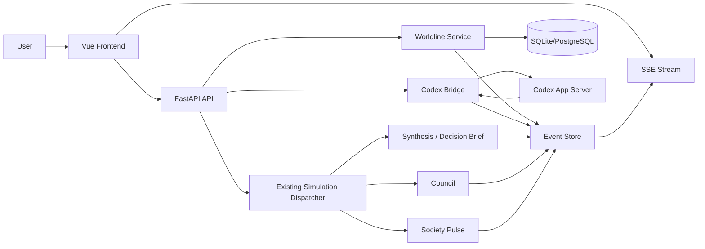

# agoraAI Codex App Server活用 仕様書

作成日: 2026-05-07  
対象: `usagi917/agoraAI`  
仕様対象: Codex App Serverを用いた世界線分岐・外部エージェントレビュー・イベント統合機能

---

## 1. 概要

本仕様は、agoraAIにCodex App Serverを統合し、既存のマルチエージェント社会反応シミュレーションを**分岐可能・履歴保持可能・外部エージェントレビュー可能なScenario Workbench**へ拡張するための仕様である。

Codex App Serverは、既存のLiteLLMベースのシミュレーション生成を置き換えない。主な役割は以下である。

- 世界線ごとのCodex thread管理
- 専門家・反証役・編集者としてのCodex turn実行
- Codex通知イベントのSSE変換
- Codexによるレビュー・批評・代替仮説生成
- 将来的な承認・証跡・Proof of Trust連携の下地

Codex App Server連携はOpenAI公式のApp Server protocolを前提にする。実装時は対象Codex CLIバージョンで`codex app-server generate-json-schema`または`generate-ts`を実行し、生成schemaをBridge実装とcontract testの基準にする。

---

## 2. 用語定義

| 用語 | 意味 |
|---|---|
| Simulation | 既存agoraAIの1回の分析実行 |
| Worldline | ある初期条件・介入条件に基づくシナリオ状態の履歴単位 |
| Fork | 既存Worldlineから条件を変えて派生Worldlineを作る操作 |
| Codex Thread | Codex App Server側の会話スレッド |
| Codex Turn | Codex Thread内の1回の依頼 |
| Event Envelope | agoraAI内で統一して扱うイベント形式 |
| Expert Review | Codexが専門家・反証役として行うレビュー |
| Provenance | 入力、実行、承認、出力の証跡 |

---

## 3. ユースケース

## UC-1: 完了済みsimulationから世界線を作る

### 入力

- `simulation_id`
- `title`
- `description`
- `initial_conditions`

### 処理

1. 既存simulationの入力、人口生成結果、Council結果、Decision Briefを参照する
2. `worldline`を作成する
3. `worldline.created`イベントを保存・配信する

### 出力

- `worldline_id`
- `simulation_id`
- `status`

---

## UC-2: 世界線をforkする

### 入力

- `source_worldline_id`
- `fork_title`
- `intervention_prompt`
- `changed_conditions`

### 処理

1. 元Worldlineのsnapshotを取得する
2. fork条件を保存する
3. 新しいWorldlineを作成する
4. 必要に応じて新規simulationを起動する
5. Codex連携が有効な場合はCodex threadをforkまたは新規作成する

Snapshotには最低限、元simulation入力、`execution_profile`、seed、population snapshot、Council transcript、Decision Brief、主要設定・template version、既存Expert Review要約を含める。これによりfork後の差分が「入力条件の違い」なのか「実行時の偶然」なのかを追跡できるようにする。

### 出力

- `new_worldline_id`
- `parent_worldline_id`
- `fork_reason`

---

## UC-3: Codex Expert Reviewを実行する

### 入力

- `worldline_id`
- `role`: `policy_critic` / `market_analyst` / `risk_officer` / `counterfactual_reviewer` / `synthesis_editor`
- `review_target`: `pulse` / `council` / `decision_brief` / `comparison`
- `instructions`

### 処理

1. Worldlineのcontextを組み立てる
2. Codex threadを開始または再開する
3. `turn/start`を実行する
4. Codex通知を`codex.*`イベントへ変換する
5. 最終出力をExpert Reviewとして保存する

### 出力

- `codex_thread_id`
- `codex_turn_id`
- `review_artifact_id`
- `review_summary`

---

## UC-4: 複数世界線を比較する

### 入力

- `worldline_ids[]`
- `comparison_axis[]`

例:

```json
{
  "worldline_ids": ["wl_a", "wl_b", "wl_c"],
  "comparison_axis": ["public_reaction", "economic_risk", "policy_feasibility"]
}
```

### 処理

1. 各WorldlineのDecision Briefを取得する
2. Agent reactions / Council / Expert Reviewを集約する
3. 差分を軸別に要約する
4. 比較Decision Briefを生成する

### 出力

- `comparison_report_id`
- `summary`
- `key_differences`
- `recommended_next_questions`

---

## 4. システム構成

## 4.1 既存構成

```text
Frontend: Vue 3 + Vite
Backend: FastAPI + async SQLAlchemy + LiteLLM
Runtime: SQLite local / PostgreSQL optional / Redis optional
Progress: SSE
Config: config/*.yaml, templates/ja/*.yaml
```

## 4.2 追加構成

```text
Frontend
  ├── Worldline Explorer
  ├── Event Timeline
  ├── Codex Expert Panel
  ├── Fork Compare View
  └── Approval / Provenance Panel

Backend
  ├── Worldline Service
  ├── Event Store
  ├── Codex Bridge
  ├── Expert Review Service
  ├── Approval Service
  └── Provenance Service

External Process
  └── codex app-server
```

## 4.3 アーキテクチャ図



---

## 5. データモデル仕様

## 5.1 `worldlines`

| Field | Type | Required | 説明 |
|---|---:|---:|---|
| `id` | UUID/string | yes | Worldline ID |
| `source_simulation_id` | string | no | Worldline作成元の既存simulation |
| `current_simulation_id` | string | no | 現在表示・比較対象にする代表simulation |
| `parent_worldline_id` | string | no | fork元 |
| `title` | string | yes | 表示名 |
| `description` | text | no | 説明 |
| `status` | enum | yes | `draft` / `running` / `completed` / `failed` / `archived` |
| `initial_conditions` | json | no | 初期条件 |
| `intervention` | json | no | fork時の変更条件 |
| `snapshot` | json | no | fork元または作成元の再現用snapshot |
| `fork_reason` | text | no | fork理由・仮説 |
| `lineage_depth` | integer | yes | fork階層深度 |
| `created_at` | datetime | yes | 作成時刻 |
| `updated_at` | datetime | yes | 更新時刻 |

`Worldline`はシナリオ履歴の単位であり、1つのsimulationだけに固定しない。rerun、fork後の再実行、比較用runを扱うため、実行履歴は`worldline_runs`に分離する。

## 5.2 `worldline_runs`

| Field | Type | Required | 説明 |
|---|---:|---:|---|
| `id` | UUID/string | yes | Worldline run ID |
| `worldline_id` | string | yes | 所属Worldline |
| `simulation_id` | string | yes | 実行されたSimulation |
| `run_type` | enum | yes | `initial` / `fork_simulation` / `rerun` / `comparison` |
| `status` | enum | yes | `queued` / `running` / `completed` / `failed` |
| `input_snapshot` | json | no | 実行時入力・設定snapshot |
| `created_at` | datetime | yes | 作成時刻 |
| `completed_at` | datetime | no | 完了時刻 |

## 5.3 `worldline_events`

| Field | Type | Required | 説明 |
|---|---:|---:|---|
| `id` | UUID/string | yes | Event ID |
| `worldline_id` | string | yes | 所属Worldline |
| `simulation_id` | string | no | 関連simulation |
| `sequence_no` | integer | yes | Worldline内の単調増加sequence |
| `source` | enum | yes | `simulation` / `codex` / `user` / `system` |
| `type` | string | yes | `worldline.created`など |
| `stage` | string | no | `pulse`, `council`, `synthesis`, `codex_review`など |
| `agent_id` | string | no | 関連agent |
| `external_id` | string | no | 外部システム側のイベントIDまたはrequest ID |
| `codex_thread_id` | string | no | 関連Codex thread |
| `codex_turn_id` | string | no | 関連Codex turn |
| `codex_item_id` | string | no | 関連Codex item |
| `persist_policy` | enum | yes | `persist` / `stream_only` |
| `payload` | json | yes | 任意payload |
| `created_at` | datetime | yes | 発生時刻 |

## 5.4 `codex_sessions`

| Field | Type | Required | 説明 |
|---|---:|---:|---|
| `id` | UUID/string | yes | 内部session ID |
| `worldline_id` | string | no | 紐づくWorldline |
| `codex_thread_id` | string | yes | Codex thread ID |
| `transport` | enum | yes | `stdio` / `websocket` |
| `model` | string | no | Codex model |
| `cwd` | string | no | Codex turn実行時の作業ディレクトリ |
| `app_server_version` | string | no | Codex CLI / app-server version |
| `schema_version` | string | no | 生成schemaの識別子 |
| `capabilities` | json | no | initialize時に送ったcapabilities |
| `status` | enum | yes | `starting` / `ready` / `failed` / `closed` |
| `metadata` | json | no | Codex設定 |
| `created_at` | datetime | yes | 作成時刻 |

## 5.5 `codex_turns`

| Field | Type | Required | 説明 |
|---|---:|---:|---|
| `id` | UUID/string | yes | 内部turn ID |
| `codex_session_id` | string | yes | Codex session |
| `codex_turn_id` | string | no | Codex turn ID |
| `role` | string | no | Expert role |
| `input` | json | yes | Codexへ送った入力 |
| `status` | enum | yes | `in_progress` / `completed` / `failed` / `interrupted` |
| `result` | json | no | 最終結果 |
| `last_item_id` | string | no | 最後に処理したCodex item |
| `error_info` | json | no | Codex error payload |
| `created_at` | datetime | yes | 作成時刻 |
| `completed_at` | datetime | no | 完了時刻 |

## 5.6 `approval_requests`

| Field | Type | Required | 説明 |
|---|---:|---:|---|
| `id` | UUID/string | yes | 承認ID |
| `worldline_id` | string | no | 関連Worldline |
| `codex_turn_id` | string | no | 関連Codex turn |
| `server_request_id` | string | yes | Codex App Serverからのserver-initiated request ID |
| `codex_item_id` | string | no | 承認対象item |
| `request_type` | enum | yes | `command` / `file_change` / `publish_report` / `external_tool` |
| `reason` | text | no | 承認理由 |
| `available_decisions` | json | no | App Serverが提示した選択肢 |
| `payload` | json | yes | 承認対象 |
| `status` | enum | yes | `pending` / `accepted` / `declined` / `cancelled` |
| `decision_by` | string | no | 承認者 |
| `decided_at` | datetime | no | 承認時刻 |

初期MVPでは、UI承認が未実装でもBridgeが停止しないよう、command/file change approval requestは原則`decline`または`cancel`でfail-closedに処理する。

## 5.7 `review_artifacts`

| Field | Type | Required | 説明 |
|---|---:|---:|---|
| `id` | UUID/string | yes | artifact ID |
| `worldline_id` | string | yes | 対象Worldline |
| `codex_turn_id` | string | no | 生成元turn |
| `role` | string | yes | expert role |
| `target` | string | yes | review target |
| `summary` | text | yes | 要約 |
| `findings` | json | yes | 指摘一覧 |
| `limitations` | json | no | 限界・不確実性 |
| `created_at` | datetime | yes | 作成時刻 |

---

## 6. Event Envelope仕様

## 6.1 基本形

```json
{
  "event_id": "evt_123",
  "worldline_id": "wl_123",
  "simulation_id": "sim_123",
  "sequence_no": 42,
  "source": "codex",
  "type": "codex.item.agent_delta",
  "stage": "codex_review",
  "agent_id": "policy_critic",
  "external_id": "req_10",
  "codex_thread_id": "thr_123",
  "codex_turn_id": "turn_456",
  "codex_item_id": "item_789",
  "persist_policy": "persist",
  "payload": {},
  "created_at": "2026-05-07T00:00:00Z"
}
```

### フィールド方針

- `sequence_no`はWorldline単位で単調増加させ、SSE再接続・event replay・欠落検知に使う
- `external_id`はCodex JSON-RPC request id、外部event id、またはsimulation側event idを格納する
- `codex_thread_id` / `codex_turn_id` / `codex_item_id`はpayloadに埋めず、検索・相関用にトップレベルにも持つ
- `persist_policy=stream_only`のdeltaはUIには流すが、DBには集約結果だけを保存してもよい

## 6.2 主要イベントタイプ

### Worldline

```text
worldline.created
worldline.forked
worldline.updated
worldline.completed
worldline.failed
```

### Simulation

```text
simulation.started
simulation.progress
simulation.completed
simulation.failed
```

### Society Pulse

```text
pulse.population.generated
pulse.agent.selected
pulse.agent.activated
pulse.opinion.evaluated
```

### Council

```text
council.started
council.round.started
council.message.created
council.round.completed
council.completed
```

### Synthesis

```text
synthesis.started
synthesis.brief.delta
synthesis.completed
```

### Codex

```text
codex.thread.started
codex.turn.started
codex.item.started
codex.item.completed
codex.item.agent_delta
codex.item.reasoning_delta
codex.item.command_output_delta
codex.turn.completed
codex.error
```

### Approval

```text
approval.requested
approval.accepted
approval.declined
approval.cancelled
approval.resolved
```

---

## 7. API仕様

## 7.1 Worldline API

### `POST /worldlines/from-simulation`

完了済みsimulationからWorldlineを作成する。

Request:

```json
{
  "simulation_id": "sim_123",
  "title": "AI規制強化シナリオ",
  "description": "初期simulationを世界線として保存する"
}
```

Response:

```json
{
  "worldline": {
    "id": "wl_123",
    "simulation_id": "sim_123",
    "parent_worldline_id": null,
    "title": "AI規制強化シナリオ",
    "status": "completed"
  }
}
```

### `POST /worldlines/{worldline_id}/forks`

Worldlineをforkする。

Request:

```json
{
  "title": "規制緩和シナリオ",
  "intervention_prompt": "AI規制を緩和し、企業の開発自由度を上げた場合",
  "changed_conditions": {
    "policy": "deregulation",
    "time_horizon_months": 12
  },
  "start_simulation": true
}
```

Response:

```json
{
  "worldline": {
    "id": "wl_456",
    "parent_worldline_id": "wl_123",
    "title": "規制緩和シナリオ",
    "status": "running"
  }
}
```

### `GET /worldlines/{worldline_id}/events`

Worldlineのイベント履歴を取得する。

Query:

```text
?cursor=...&limit=100&type=codex.item.agent_delta
```

Response:

```json
{
  "data": [],
  "next_cursor": null
}
```

### `GET /worldlines/{worldline_id}/stream`

Worldline単位のSSE streamを返す。

---

## 7.2 Codex API

### `GET /codex/health`

Codex連携の状態を返す。

Response:

```json
{
  "enabled": true,
  "available": true,
  "transport": "stdio",
  "error": null
}
```

### `POST /codex/sessions`

Codex threadを開始する。

Request:

```json
{
  "worldline_id": "wl_123",
  "model": null,
  "cwd": "/Users/me/agoraAI",
  "role": "policy_critic"
}
```

Response:

```json
{
  "session": {
    "id": "cdx_sess_123",
    "worldline_id": "wl_123",
    "codex_thread_id": "thr_123",
    "status": "ready"
  }
}
```

### `POST /codex/sessions/{session_id}/turns`

Codex turnを開始する。

Request:

```json
{
  "input": [
    {
      "type": "text",
      "text": "このDecision Briefを政策リスクの観点から批評してください。"
    }
  ],
  "review_target": "decision_brief"
}
```

Response:

```json
{
  "turn": {
    "id": "cdx_turn_123",
    "codex_turn_id": "turn_456",
    "status": "in_progress"
  }
}
```

---

## 7.3 Expert Review API

### `POST /worldlines/{worldline_id}/expert-reviews`

Worldlineに対してCodex Expert Reviewを実行する。

Request:

```json
{
  "role": "counterfactual_reviewer",
  "target": "decision_brief",
  "instructions": "前提の弱さ、見落とした反証、別の因果経路を指摘してください。"
}
```

Response:

```json
{
  "review": {
    "id": "review_123",
    "status": "in_progress",
    "codex_session_id": "cdx_sess_123",
    "codex_turn_id": "cdx_turn_123"
  }
}
```

---

## 8. Codex Bridge仕様

## 8.1 Transport

初期は`stdio`を標準とする。

```bash
codex app-server
```

Codex App ServerはJSON-RPC 2.0形式の双方向通信を行う。`stdio`ではJSONL、WebSocketではWebSocket text frameを使う。WebSocketは将来対応とし、利用する場合はloopback限定かつcapability tokenまたはsigned bearer tokenを必須にする。非loopback WebSocketは初期仕様では禁止する。

## 8.2 Schema生成

Bridge実装前に、対象Codex CLIバージョンからschemaを生成する。

```bash
codex app-server generate-json-schema --out docs/codex-app-server-schema
codex app-server generate-ts --out docs/codex-app-server-schema
```

生成物は実装時のcontract testに使う。Codex CLIを更新した場合はschema差分を確認し、`docs/codex-integration-notes.md`に変更点を記録する。

## 8.3 起動フロー

1. Backend起動時または初回リクエスト時にCodex Bridgeを初期化する
2. `codex app-server`プロセスを起動する
3. stdoutをJSONLとして読み取る
4. stdinへJSON-RPC requestを送る
5. `initialize`を送る
6. `initialized`通知を送る
7. thread/turn APIを使用可能にする

`initialize`には`clientInfo`を必ず含める。安定APIだけで開始し、experimental APIが必要な機能は明示的な設定でのみ`capabilities.experimentalApi=true`を送る。

## 8.4 JSON-RPC request ID

- Backend内で単調増加のintegerを使う
- request pending mapを持つ
- response idによりfutureをresolveする
- notificationはevent mapperに渡す
- app-serverからのserver-initiated requestもpending mapで管理し、必ずresponseを返す

## 8.5 Codex → agoraAI event mapping

| Codex通知 | agoraAI event |
|---|---|
| `thread/started` | `codex.thread.started` |
| `turn/started` | `codex.turn.started` |
| `item/started` | `codex.item.started` |
| `item/agentMessage/delta` | `codex.item.agent_delta` |
| `item/reasoning/summaryTextDelta` | `codex.item.reasoning_delta` |
| `item/commandExecution/outputDelta` | `codex.item.command_output_delta` |
| `item/completed` | `codex.item.completed` |
| `turn/completed` | `codex.turn.completed` |
| `error` | `codex.error` |
| `serverRequest/resolved` | `approval.resolved` |
| `item/commandExecution/requestApproval` | `approval.requested` |
| `item/fileChange/requestApproval` | `approval.requested` |

## 8.6 承認request処理

Codex App Serverはcommand executionやfile changeの承認をserver-initiated JSON-RPC requestとして送る。Bridgeは以下の順で処理する。

1. `approval_requests`に保存する
2. `approval.requested`をWorldline streamへ配信する
3. UI承認が有効ならユーザー判断を待つ
4. UI承認が無効またはtimeoutした場合は`decline`または`cancel`でfail-closedに応答する
5. `serverRequest/resolved`を受けて`approval.resolved`へ変換する

初期MVPでは`AGORAAI_CODEX_ALLOW_COMMANDS=false`、`AGORAAI_CODEX_ALLOW_FILE_CHANGES=false`を既定とし、承認UIが未実装でも安全に終了することを必須にする。

## 8.7 エラー処理

| 状態 | 返却 |
|---|---|
| Codex disabled | `503`, `enabled=false` |
| app-server command not found | `503`, `available=false` |
| initialize failed | `500`, error message |
| turn failed | `codex.error` event + turn status `failed` |
| overload | retryable errorとして扱う |

---

## 9. Expert Role仕様

## 9.1 Role Profile

RoleはYAMLまたはDBで管理する。

```yaml
id: policy_critic
title: Policy Critic
language: ja
objective: 政策影響分析の前提、反証、実行可能性を批評する
output_format:
  - summary
  - key_risks
  - weak_assumptions
  - counterfactuals
  - suggested_followups
```

## 9.2 初期Role

| Role | 目的 |
|---|---|
| `policy_critic` | 政策実行可能性・副作用を批評 |
| `market_analyst` | 市場参入・競合・需要を批評 |
| `risk_officer` | 社会的・倫理的・法務的リスクを指摘 |
| `counterfactual_reviewer` | 別の因果経路・反事実を提示 |
| `synthesis_editor` | Decision Briefの明瞭性・論理構造を改善 |

## 9.3 Prompt Assembly

Codexへ送る入力は次の順序で組み立てる。

1. Role instruction
2. Worldline summary
3. Original user prompt
4. Simulation outputs
5. Council debate summary
6. Decision Brief
7. Review target and requested output

---

## 10. Frontend仕様

## 10.1 追加画面・コンポーネント

```text
frontend/src/components/WorldlineExplorer.vue
frontend/src/components/WorldlineTimeline.vue
frontend/src/components/CodexExpertPanel.vue
frontend/src/components/ForkComparePanel.vue
frontend/src/components/ApprovalModal.vue
frontend/src/components/ProvenancePanel.vue
```

## 10.2 Worldline Explorer

表示項目:

- Worldline tree
- parent / child relationship
- status badge
- associated simulation id
- latest report link
- fork action
- expert review action

## 10.3 Codex Expert Panel

表示項目:

- role selector
- review target selector
- instruction input
- streaming response
- final findings
- save to report button

## 10.4 Event Timeline

表示項目:

- simulation events
- council messages
- codex deltas
- approval requests
- report generation events

## 10.5 Compare View

表示項目:

- selected worldlines
- scenario conditions
- opinion / probability / risk shifts
- Codex critic findings
- comparison Decision Brief

## 10.6 グラフ可視化方針

既存のKnowledge Graph / Social Graph表示は、読みやすさと保守性を優先して2D平面グラフに統一する。3D/WebGL表示はMVP対象外とし、Three.js / `3d-force-graph` 依存を持たない。

要件:

- Obsidian風の2D force graphとして、ノード、エッジ、クラスタ、ハブを平面上で把握できる
- WebGL非対応環境でも同じUIが動作する
- ノードクリックで詳細表示またはAgent Story Drawerを開ける
- エッジhover/clickで関係種別、強度、会話履歴を確認できる
- Society modeではsocial edge、KG layer、agent-entity linkの表示切替を維持する
- 3Dカメラ操作、Bloom、Three.js particle演出は採用しない

---

## 11. 設定仕様

## 11.1 `.env`

```env
# Codex integration
AGORAAI_CODEX_ENABLED=false
AGORAAI_CODEX_TRANSPORT=stdio
AGORAAI_CODEX_COMMAND=codex
AGORAAI_CODEX_ARGS=app-server
AGORAAI_CODEX_DEFAULT_MODEL=
AGORAAI_CODEX_CWD=
AGORAAI_CODEX_TIMEOUT_SECONDS=120
AGORAAI_CODEX_APPROVAL_TIMEOUT_SECONDS=30

# Safety
AGORAAI_CODEX_ALLOW_COMMANDS=false
AGORAAI_CODEX_REQUIRE_APPROVAL=true
AGORAAI_CODEX_ALLOW_FILE_CHANGES=false

# Worldlines
AGORAAI_WORLDLINE_EVENT_RETENTION_DAYS=90
AGORAAI_WORLDLINE_MAX_FORK_DEPTH=5
```

`AGORAAI_CODEX_DEFAULT_MODEL`が空の場合はCodex側の設定・既定モデルに従う。アプリ仕様に特定モデル名を焼き込まず、必要な環境だけで明示指定する。

## 11.2 `config/codex_roles.yaml`

Expert Role定義を置く。

## 11.3 `config/features.yaml`

```yaml
features:
  worldlines: true
  codex_bridge: false
  codex_expert_review: false
  approvals: false
  provenance: false
```

---

## 12. セキュリティ仕様

## 12.1 初期安全設定

- Codex連携はdefault off
- command executionはdefault off
- file changeはdefault off
- approvalはdefault required
- WebSocket transportは初期非対応またはloopback限定
- tokenやAPI keyはCLI引数に直接渡さない

## 12.2 承認が必要な操作

- Codexによる外部コマンド実行
- Codexによるファイル変更
- レポート公開
- 外部連携へのデータ送信
- Proof of Trust記録の確定

## 12.3 データ取り扱い

- Codexに渡すcontextは必要最小限にする
- 添付ファイルの内容をCodexへ送る場合はユーザー明示承認を挟む
- 企業・政策・個人データはredaction可能にする

---

## 13. テスト仕様

## 13.1 Backend Unit Tests

```text
tests/test_worldline_service.py
tests/test_event_envelope.py
tests/test_codex_jsonrpc.py
tests/test_codex_event_mapper.py
tests/test_approval_service.py
```

### 重要ケース

- worldline creation
- fork parent linkage
- event ordering
- Codex response matching by id
- notification mapping
- Codex disabled behavior
- approval decision update

## 13.2 Integration Tests

```text
simulation completed
  → worldline created
  → fork created
  → fake codex turn started
  → codex events streamed
  → review artifact saved
```

Codex本体に依存しないfake app-serverを作る。

## 13.3 Frontend Tests

```text
WorldlineExplorer renders tree
CodexExpertPanel streams delta
ApprovalModal accept/decline works
ForkComparePanel shows differences
ForceGraph2D renders nodes/edges and supports node/edge selection
SimulationPage renders Knowledge Graph through ForceGraph2D without WebGL branching
LiveSocietyGraph renders Social Graph through ForceGraph2D and keeps KG scrubber behavior
```

## 13.4 E2E Tests

- LaunchPadからsimulation実行
- 結果からWorldline作成
- Worldline fork
- Codex Expert Review実行
- Compare画面表示

---

## 14. 受け入れ基準

## Alpha

- [ ] 既存simulationがCodex無効状態で動く
- [ ] 完了simulationからWorldlineを作成できる
- [ ] Worldlineをforkできる
- [ ] Codex Bridgeがstdioでinitializeできる
- [ ] Codex Expert Reviewを開始できる
- [ ] Codex streamがSSEに表示される
- [ ] Expert Review artifactが保存される
- [ ] command/file change approval requestをfail-closedで処理できる
- [ ] Knowledge Graph / Social Graphが2D平面グラフとして表示され、3D/WebGL依存が残っていない

## Beta

- [ ] 複数Worldline比較ができる
- [ ] Event replayができる
- [ ] Approval requestをUIで処理できる
- [ ] Provenance panelに実行証跡を表示できる
- [ ] Codex未導入環境でもerrorが明確に表示される

## Production候補

- [ ] 認証・権限管理が入っている
- [ ] WebSocket transportを使う場合はtoken auth必須
- [ ] 秘密情報redactionがある
- [ ] observabilityがある
- [ ] 失敗時の再試行・復元がある

---

## 15. 実装ファイル案

```text
backend/src/app/models/worldline.py
backend/src/app/models/codex.py
backend/src/app/models/approval.py
backend/src/app/models/review_artifact.py

backend/src/app/schemas/worldline.py
backend/src/app/schemas/codex.py
backend/src/app/schemas/events.py
backend/src/app/schemas/approval.py

backend/src/app/services/worldline_service.py
backend/src/app/services/event_store.py
backend/src/app/services/expert_review_service.py
backend/src/app/services/approval_service.py
backend/src/app/services/codex_bridge/client.py
backend/src/app/services/codex_bridge/process.py
backend/src/app/services/codex_bridge/event_mapper.py
backend/src/app/services/codex_bridge/jsonrpc.py

backend/src/app/api/routes/worldlines.py
backend/src/app/api/routes/codex.py
backend/src/app/api/routes/approvals.py

frontend/src/api/worldlines.ts
frontend/src/api/codex.ts
frontend/src/api/approvals.ts
frontend/src/types/worldline.ts
frontend/src/types/events.ts
frontend/src/components/WorldlineExplorer.vue
frontend/src/components/WorldlineTimeline.vue
frontend/src/components/CodexExpertPanel.vue
frontend/src/components/ForkComparePanel.vue
frontend/src/components/ApprovalModal.vue
frontend/src/components/ProvenancePanel.vue
```

---

## 16. CLI検証手順

## 16.1 既存アプリ起動

```bash
cp .env.example .env
docker compose up --build
```

## 16.2 Backend local

```bash
cd backend
uv sync --extra dev
uv run uvicorn src.app.main:app --reload --host 0.0.0.0 --port 8000
```

## 16.3 Frontend local

```bash
cd frontend
pnpm install
pnpm dev
```

## 16.4 Codex App Server単体確認

```bash
codex app-server
```

Schema更新確認:

```bash
codex app-server generate-json-schema --out docs/codex-app-server-schema
codex app-server generate-ts --out docs/codex-app-server-schema
```

別途、Bridgeのunit testではfake serverを使い、Codex実体への依存を避ける。

---

## 17. 将来拡張

## 17.1 Skills連携

Codex App ServerのSkillを使い、Roleごとに専門ルールを注入する。

例:

```text
skills/agora-policy-critic/SKILL.md
skills/agora-market-analyst/SKILL.md
skills/agora-counterfactual-reviewer/SKILL.md
```

## 17.2 MCP / Apps連携

- Web search
- Notion
- GitHub
- Google Drive
- 統計データソース

などを外部知識取得に使う。ただし初期は安全上オフにする。

## 17.3 Proof of Trust

Provenanceを次の形に拡張する。

```text
Worldline
  ↓
Simulation inputs
  ↓
Agent outputs
  ↓
Expert Review
  ↓
Human approval
  ↓
Report artifact
  ↓
Signed provenance record
  ↓
Optional on-chain anchoring
```

---

## 18. 設計判断

### 18.1 Codexをsimulation coreにしない理由

既存agoraAIはすでにSociety Pulse、Council、Synthesisの明確なパイプラインを持つ。Codexを中核に置くと既存構造が崩れるため、初期は外部専門家・反証役・実行履歴として使う。

### 18.2 Worldlineを先に入れる理由

Codex連携よりも、世界線というプロダクト概念の方が重要。Worldlineがあれば、Codexなしでもscenario-pairsやrerunを整理できる。

### 18.3 Event Envelopeを先に入れる理由

Codex App Serverは多様な通知を出す。既存SSEと混ぜるには、先に共通イベント形式を定義しないとUIとDBが肥大化する。

---

## 19. MVP仕様まとめ

MVPで完成させる体験:

```text
1. ユーザーが通常のsimulationを実行する
2. 完了結果をWorldlineとして保存する
3. Worldlineをforkして別条件を試す
4. 各WorldlineにCodex Expert Reviewをかける
5. レビュー結果をSSEでライブ表示する
6. 比較Decision Briefに反証・リスク・代替仮説を追加する
```

このMVPが完成すると、agoraAIは「1回だけ答えるAI」ではなく、**分岐した仮説世界を比較し、AI評議会と外部専門家が検証する意思決定支援ツール**になる。
